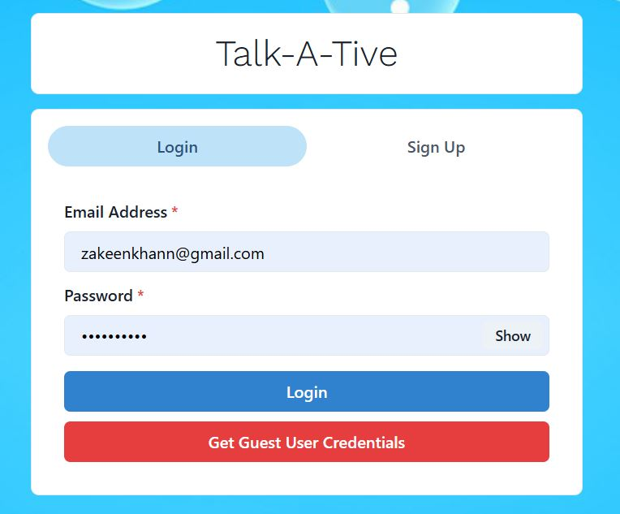

# Talk-A-Tive

Talk-A-Tive is a modern, full-stack real-time chatting application built with the MERN stack. It provides seamless communication through instant messaging, group chats, and user management features.

## Key Highlights
- 🚀 **Real-time Communication**: Powered by Socket.io for instant messaging
- 🔐 **Secure Authentication**: JWT-based authentication with encrypted user data
- 👥 **Group Chat Support**: Create and manage group conversations
- 📱 **Responsive Design**: Works seamlessly across desktop and mobile devices
- 🗄️ **MongoDB Integration**: Secure data storage with encrypted user information
## Tech Stack

**Client:** React JS

**Server:** Node JS, Express JS

**Database:** Mongo DB
  
## Demo

[https://talk-a-tive.herokuapp.com/](https://talk-a-tive-7fgq.onrender.com)

## Features

### User Authentication
- **Sign Up**: Create a new account with email and password
- **Login**: Secure user authentication




### User Profile Management
- View and update user profile information
- Profile picture support


### Real-time Messaging
- Instant messaging with Socket.io
- Real-time message delivery and notifications


### Group Chat Features
- Create and manage group chats
- Add/remove users from groups
- Group profile updates


## Run Locally

Clone the project

```bash
  git clone https://github.com/zakeenkhan/ChattingApp.git
```

Go to the project directory

```bash
  cd ChattingApp
```

Install dependencies

```bash
  npm install
```

```bash
  cd frontend/
  npm install
```

Start the server

```bash
  npm run start
```
Start the Client

```bash
  //open now terminal
  cd frontend
  npm start
```

## Environment Variables

To run this project, you will need to add the following environment variables to your .env file in the backend directory:

```bash
PORT=5000
MONGO_URI=your_mongodb_connection_string
JWT_SECRET=your_jwt_secret_key
NODE_ENV=production
```

## Contributing

Contributions are always welcome! Please feel free to submit a Pull Request.

## License

This project is open source and available under the [MIT License](LICENSE).

---

**Made with ❤️ by [Zakeen Khan](https://github.com/zakeenkhan)**